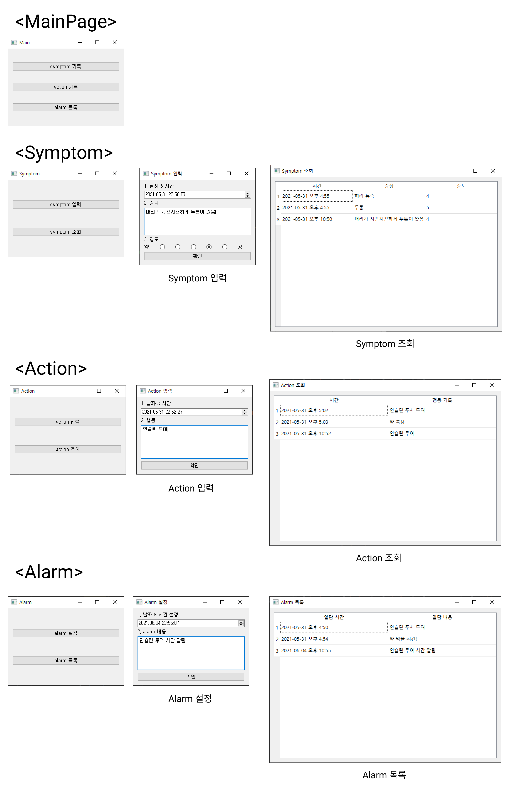

# UC-10-Disease-Management
Repository for Team B's subprogram, Disease Management

## Requirement
- Windows, MacOS or Linux (Ubuntu recommended)
- Python 3 (We tested in conda, but not necessary)
  - PyQt5
  - pymongo
  - dnspython


## Overview

- **makeInform.py** : makeQuery()함수에서 alarm2.py / symptom2.py / action2.py 로 부터 QWidget 리스트를 불러와, 사용자의 입력값을 딕셔너리 형태로 변경하여 반환
 
- **databaseConnection.py** : dbSave()함수에서 makeInform으로부터 딕셔너리 값을 받아, mongoDB에 save / loadDB()함수에서 mongoDB로부터 데이터값을 불러와, 리스트 형태로 변경하여 반환

- **alarm2.py / symptom2.py / action2.py** : '확인'버튼을 누를 시, 사용자가 입력한 값을 makeInform에서 딕셔너리 형태로 변환하고, databaseConnection에서 mongoDB에 저장

- **alarm1.py / symptom1.py / action1.py** : alarm/symptom/action 등록 및 조회 버튼을 누르면 해당하는 페이지로 연결됨

- **alarm3.py / symptom3.py / action3.py** : databaseConnection에서 mongoDB속 해당 컬렉션의 데이터들을 불러와, 조회 가능


## Demo
You can see demonstration of the project below

- screenshot example



## Installation
The package requires python3, pymongo, dnspython
- Download the repository

```
git clone https://github.com/CAU-SE-Project/UC-10-Disease-Management.git
```

### Download selenium and PyQt5
```
cd UC-10-Disease-Management
pip install PyQt5
pip install pymongo
pip install dnspython
```

### Run Demo
```
cd UC-10-Disease-Management
python main_page.py
```
